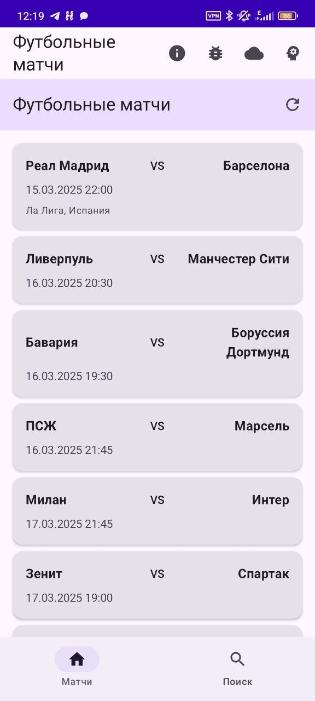
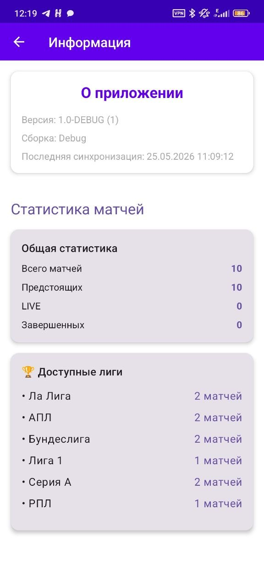
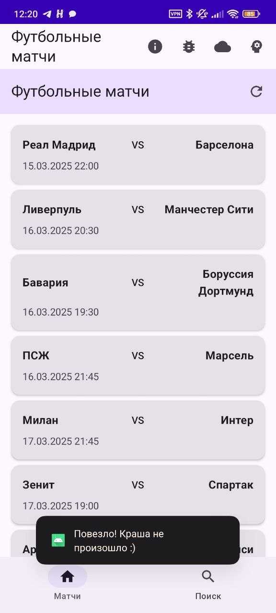
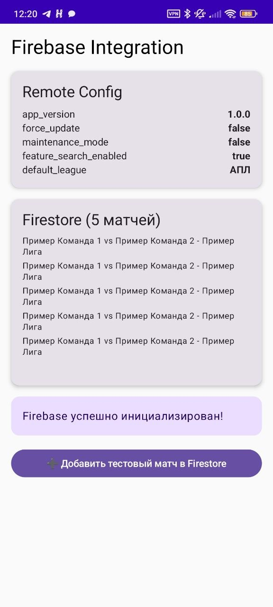
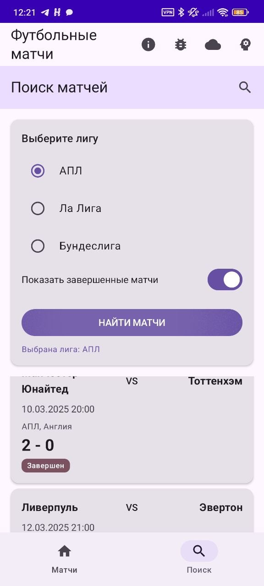
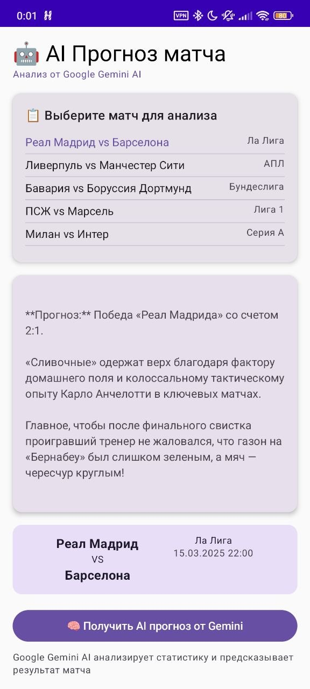

Пользователь может просматривать расписание предстоящих боёв с детальной информацией о боксёрах (весовая категория, рекорд, нокауты), лигах (WBA, WBC, IBF, WBO) и времени проведения. Доступен поиск и фильтрация боёв по весовым категориям и организациям с возможностью просмотра архива завершённых поединков и истории титульных боёв.

ОБЯЗАТЕЛЬНЫЕ КРИТЕРИИ 15 БАЛЛОВ

Чистая архитектура 5 б

domain/model/Match.kt - доменная модель
domain/model/MatchStatus.kt - enum статусов
domain/repository/MatchRepository.kt - интерфейс репозитория
domain/usecase/GetUpcomingMatchesUseCase.kt - use case
domain/usecase/SearchMatchesUseCase.kt - use case
domain/usecase/GetArchiveMatchesUseCase.kt - use case
data/repository/MockMatchRepository.kt - реализация репозитория
data/mock/MockDataProvider.kt - мок-данные
feature/home/HomeViewModel.kt - presentation слой
feature/search/SearchViewModel.kt - presentation слой
feature/match/MatchViewModel.kt - presentation слой
app/di/AppModule.kt - Koin DI
app/build.gradle.kts - 5 модулей app, core, data, domain, feature

Фоновые задачи и сервисы 3 б

data/worker/MatchesSyncWorker.kt - WorkManager периодическая задача 6 часов с Constraints
app/service/MatchesSyncService.kt - Service
app/receiver/BootReceiver.kt - BroadcastReceiver
app/FootballApp.kt - запуск WorkManager
app/AndroidManifest.xml - регистрация компонентов

Анимации в Jetpack Compose 2 б

feature/home/HomeScreen.kt - AnimatedVisibility, slideInHorizontally, animateFloatAsState, animateColorAsState, expandVertically, AnimatedContent
feature/search/SearchScreen.kt - slideInVertically, rotate, Crossfade, AnimatedVisibility

XML разметка и интеграция Compose 2 б

res/layout/activity_info.xml - XML с Toolbar, TextView, ComposeView
app/InfoActivity.kt - Activity с XML и ComposeView

Gradle конфигурация сборок 2 б

app/build.gradle.kts - buildTypes debug/release, productFlavors dev/prod, разные applicationId/URL/флаги
app/proguard-rules.pro - ProGuard правила

Качество кода и UX 1 б

feature/home/HomeState.kt - состояния Loading/Success/Error
feature/search/SearchState.kt - состояния с isLoading/error
feature/match/MatchDetailState.kt - состояния Loading/Success/Error
feature/home/HomeViewModel.kt - onFailure обработка
feature/search/SearchViewModel.kt - onFailure обработка
feature/match/MatchViewModel.kt - onFailure обработка
data/repository/MockMatchRepository.kt - try-catch с Result.failure

БОНУСНЫЕ КРИТЕРИИ 5 БАЛЛОВ

Firebase 2 б

app/build.gradle.kts - зависимости crashlytics, analytics, firestore, config
app/google-services.json - конфигурация
app/analytics/FirebaseCrashReporter.kt - CrashReporter
app/FirebaseRemoteConfigService.kt - Remote Config
app/FirestoreService.kt - Firestore
app/FirebaseTestActivity.kt - тестовый экран

Использование ИИ 2 б

app/build.gradle.kts - generativeai зависимость
app/ai/GeminiPredictionService.kt - Gemini API сервис
app/PredictionActivity.kt - экран AI прогноза
app/PredictionScreen.kt - UI прогноза

На выбор студента 1 б

app/analytics/CrashReporterManager.kt - интерфейс сбора ошибок
app/analytics/FirebaseCrashReporter.kt - кастомные события logMessage, setCustomKey, recordNonFatal
app/FootballApp.kt - глобальный обработчик исключений
app/MainActivity.kt - кнопка краша с диагностическим логом
feature/home/HomeViewModel.kt - отлов нефатальных ошибок
feature/search/SearchViewModel.kt - отлов нефатальных ошибок
data/repository/MockMatchRepository.kt - try-catch с логированием

<table>
  <tr>
    <td></td>
    <td></td>
  </tr>
  <tr>
    <td></td>
    <td></td>
  </tr>
  <tr>
    <td></td>
    <td></td>
  </tr>
</table>
